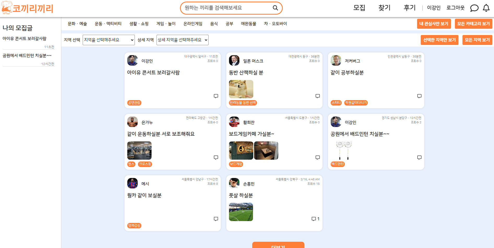
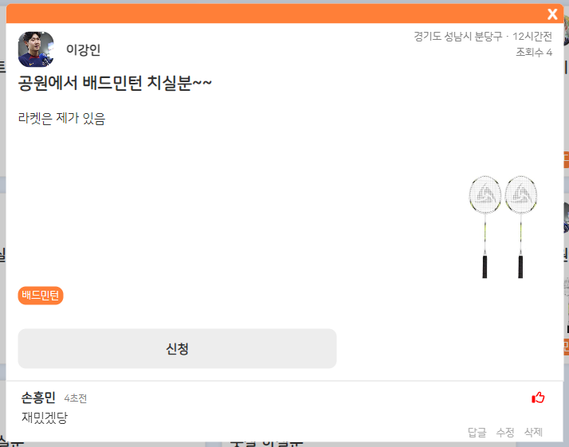
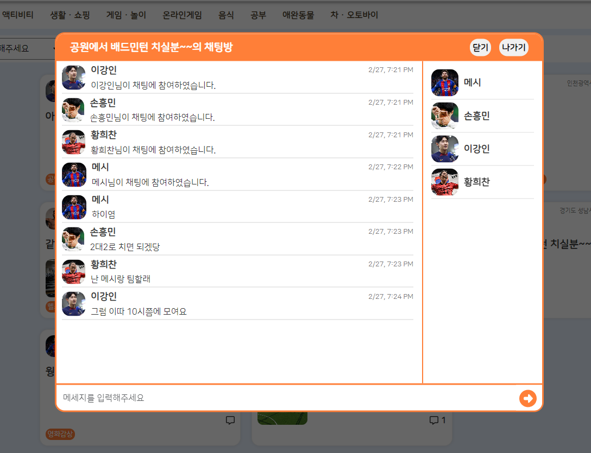

# 코끼리끼리


## 📝 프로젝트 개요

**코끼리끼리**는 사회성이 좋은 동물인 '코끼리'와 '끼리끼리 놀다'의 '끼리끼리'의 합성어로, 단순히 같이 취미생활을 즐기거나 놀 사람을 찾을 수 있는 매칭 플랫폼입니다. 기존의 매칭 플랫폼들이 특정 주제에 한정되거나 이성 만남 용도로만 사용되는 한계를 극복하고자 기획되었습니다.

## ✨ 주요 기능

- **회원 관리:**
  - 회원 가입 및 로그인 (프로필 이미지 등 다양한 정보 등록)
  - JWT 기반 사용자 인증 및 보안 세션 관리
  - 마이페이지에서 내 정보 보기/수정, 작성글/댓글 조회
  - 차단 기능을 통한 불필요한 사용자 상호작용 방지
- **매칭 시스템:**
  - 매칭글 작성을 통한 구인
  - 게시글을 보고 신청하는 방식의 매칭
  - 관심사, 지역 기반 필터링
  - 매칭 승낙 및 완료 프로세스
- **게시판 기능:**
  - 카드형 매칭글 게시판 (사진 첨부 가능)
  - 댓글/대댓글 시스템 및 좋아요 기능
  - 한줄평 형식의 후기 게시판

## 🛠️ 기술 스택

| 구분             | 기술                                                                            |
| :--------------- | :------------------------------------------------------------------------------ |
| **언어**         | `Java`, `HTML/CSS`, `JavaScript`                                                |
| **백엔드**       | `Spring`, `Spring Boot`, `WebSocket`, `Stomp`, `Query DSL`, `Apache Tomcat 9.0` |
| **프론트엔드**   | `React`, `Redux`, `Bootstrap`                                                   |
| **데이터베이스** | `Oracle 11g`                                                                    |
| **개발 도구**    | `Visual Studio Code`, `IntelliJ`, `SQL Developer`, `Github`                     |

## 📐 아키텍처 및 주요 구현 내용

### 백엔드

- **RESTful API 설계:** 자원 중심의 일관된 API 엔드포인트 설계
- **Spring Security & JWT:**

  - **Stateless 인증/인가**: 서버가 클라이언트의 상태를 유지하지 않는 Stateless 방식으로 JWT를 사용하여 사용자 인증 및 인가를 처리합니다.
  - **Security Configuration (`WebSecurityConfig.java`)**:

    - `HttpSecurity`를 사용하여 보안 설정을 구성합니다.
    - `SessionCreationPolicy.STATELESS`로 설정하여 세션을 사용하지 않습니다.
    - CORS 설정을 활성화하고 CSRF 보호는 비활성화합니다.
    - `/qiri/userInfo/**`, `/qiri/public/**`, `/ws/**` 등의 경로는 인증 없이 접근을 허용하고, 나머지 요청은 인증을 요구합니다.
    - `CorsFilter` 이후에 커스텀 필터인 `JwtAuthenticationFilter`를 추가하여 JWT 인증을 처리합니다.

    ```java
    @EnableWebSecurity
    @Configuration
    public class WebSecurityConfig {
        @Autowired
        private JwtAuthenticationFilter jwtAuthenticationFilter;

        @Bean
        public SecurityFilterChain filterChain(HttpSecurity http) throws Exception {
            http.cors().and()
                .csrf().disable()
                .httpBasic().disable()
                .sessionManagement().sessionCreationPolicy(SessionCreationPolicy.STATELESS)
                .and()
                .authorizeHttpRequests()
                .requestMatchers(/* 허용 경로 */).permitAll()
                // ... 다른 경로 설정 ...
                .anyRequest().authenticated();

            // CorsFilter 뒤에 jwtAuthenticationFilter 추가
            http.addFilterAfter(jwtAuthenticationFilter, CorsFilter.class);
            return http.build();
        }
    }
    ```

  - **JWT 토큰 생성 (`TokenProvider.java`)**:

    - 사용자가 성공적으로 로그인하면 `TokenProvider.create` 메소드를 사용하여 JWT를 생성합니다.
    - 토큰의 Payload에는 사용자의 ID(`userId`)를 Subject로 포함시키고, 발행자, 발행 시간, 만료 시간(1일) 정보를 담습니다.
    - HS512 알고리즘과 Secret Key를 사용하여 토큰을 서명합니다.

    ```java
    @Service
    public class TokenProvider {
        private static final String SECRET_KEY="..."; // 실제 키는 코드에서 확인

        public String create(UserInfo userInfo) {
            Date expiryDate = Date.from(Instant.now().plus(1, ChronoUnit.DAYS));
            return Jwts.builder()
                    .signWith(SignatureAlgorithm.HS512, SECRET_KEY)
                    .setSubject(userInfo.getUserId())
                    .setIssuer("elephant")
                    .setIssuedAt(new Date())
                    .setExpiration(expiryDate)
                    .compact();
        }
        // ... validateAndGetUserId 메소드 ...
    }
    ```

  - **JWT 토큰 검증 및 인증 처리 (`JwtAuthenticationFilter.java`)**:

    - 모든 요청에 대해 `OncePerRequestFilter`를 상속받은 `JwtAuthenticationFilter`가 실행됩니다.
    - `doFilterInternal` 메소드 내에서 `parseBearerToken`을 호출하여 요청 헤더의 `Authorization` 필드에서 `Bearer` 토큰을 추출합니다.
    - 추출된 토큰이 유효하면 `TokenProvider.validateAndGetUserId`를 호출하여 토큰의 유효성을 검증하고 Payload에서 사용자 ID를 가져옵니다.
    - 검증이 성공하면 사용자 ID를 Principal로 사용하여 `UsernamePasswordAuthenticationToken`을 생성합니다.
    - 생성된 Authentication 객체를 `SecurityContextHolder`에 설정하여 해당 요청이 인증되었음을 Spring Security에 알립니다.

    ```java
    @Component
    public class JwtAuthenticationFilter extends OncePerRequestFilter {
        @Autowired
        private TokenProvider tokenProvider;

        @Override
        protected void doFilterInternal(HttpServletRequest request, HttpServletResponse response, FilterChain filterChain) throws ServletException, IOException {
            String token = parseBearerToken(request);
            if(token != null && !token.equalsIgnoreCase("null")) {
                String userId = tokenProvider.validateAndGetUserId(token);
                // 인증 객체 생성
                AbstractAuthenticationToken authentication = new UsernamePasswordAuthenticationToken(
                        userId, null, AuthorityUtils.NO_AUTHORITIES
                );
                authentication.setDetails(new WebAuthenticationDetailsSource().buildDetails(request));
                // SecurityContext에 인증 정보 설정
                SecurityContext securityContext = SecurityContextHolder.createEmptyContext();
                securityContext.setAuthentication(authentication);
                SecurityContextHolder.setContext(securityContext);
            }
            filterChain.doFilter(request, response);
        }

        private String parseBearerToken(HttpServletRequest request) {
            String bearerToken = request.getHeader("Authorization");
            if(StringUtils.hasText(bearerToken) && bearerToken.startsWith("Bearer ")) {
                return bearerToken.substring(7);
            }
            return null;
        }
    }
    ```

- **매칭 시스템:**
  - 매칭글 작성, 신청, 승낙, 완료의 일련의 프로세스 구현
  - 매칭 신청자 목록 관리 및 차단된 사용자 필터링
- **댓글 시스템:**
  - 대댓글 기능 구현 (자기 참조 구조)
  - 댓글 좋아요 기능 구현
- **실시간 알림 및 채팅:**

  - **WebSocket Endpoint 설정 (`WebSocketConfig.java`)**:
    - STOMP 프로토콜을 사용하여 실시간 통신을 위한 WebSocket 엔드포인트를 설정합니다.
    - `/ws/chat` 엔드포인트는 채팅 메시지 교환을 위해 사용됩니다.
    - `/ws/notification` 엔드포인트는 실시간 알림 전송을 위해 사용됩니다.
    - 메시지 브로커는 `/sub` 프리픽스를 사용하고, 서버로 메시지를 보내는 경로는 `/pub` 프리픽스를 사용하도록 설정합니다.
    ```java
    @Configuration
    @EnableWebSocketMessageBroker
    public class WebSocketConfig implements WebSocketMessageBrokerConfigurer {
        @Override
        public void configureMessageBroker(MessageBrokerRegistry registry) {
            registry.enableSimpleBroker("/sub"); // 구독 경로 prefix
            registry.setApplicationDestinationPrefixes("/pub"); // 발행 경로 prefix
        }
        @Override
        public void registerStompEndpoints(StompEndpointRegistry registry) {
            registry.addEndpoint("/ws/chat").setAllowedOriginPatterns("*").withSockJS(); // 채팅 endpoint
            registry.addEndpoint("/ws/notification").setAllowedOriginPatterns("*").withSockJS(); // 알림 endpoint
        }
    }
    ```
  - **채팅 메시지 처리 흐름**:

    1.  **메시지 발행 (Client -> Server)**: 클라이언트는 `/pub/chat/message` 경로로 `ChatDTO`에 채팅 내용을 담아 발행합니다.
    2.  **메시지 처리 (`ChatController.java` -> `ChatService.java`)**: `@MessageMapping("/chat/message")` 핸들러가 메시지를 받아 `ChatService.sendMessage`를 호출합니다.
    3.  **DB 저장 및 알림 생성 (`ChatService.java`)**: `sendMessage` 메소드는 `createChatMessage`을 호출하여 메시지를 `ChatMessage` 엔티티로 변환 후 DB에 저장합니다. 동시에 채팅방 참여자 중 발신자를 제외한 사용자에게 알림 생성이 필요한지 확인하고 `NotificationMessageService.notifyProcessing`을 호출하여 알림을 생성 및 DB에 저장합니다.
    4.  **메시지 구독 (Server -> Client)**: `ChatService.createChatMessage` 메소드는 `SimpMessagingTemplate`을 사용하여 `/sub/chat/room/{chatRoomSEQ}` 경로로 `ChatDTO`를 브로드캐스팅합니다. 클라이언트는 이 경로를 구독하여 새 메시지를 수신합니다.

    ```java
    // ChatController.java
    @MessageMapping("/chat/message")
    public void sendMessage(ChatDTO dto) {
        chatService.sendMessage(dto);
    }

    // ChatService.java
    @Transactional
    public void sendMessage (ChatDTO dto) {
        // 채팅 메세지 웹소켓 전송 & DB저장
        this.createChatMessage(dto);
        // 채팅 알림처리 (발신자 제외, 중복 방지)
        UserInfo sender = uiService.findByNickname(dto.getNickname());
        List<UserChatRoomInfo> participants = ucriService.findByUserChatRoomSEQ(dto.getChatRoomSEQ());
        for(UserChatRoomInfo user : participants) {
            if(!user.getUserInfo().getUserId().equals(sender.getUserId())) {
                if (nmService.checkDuplicateNotify(user.getUserInfo().getUserId(), user.getChatRoom().getChatRoomSEQ()) == 0) {
                    nmService.notifyProcessing(user.getUserInfo(), /* 알림 메시지 */, user.getChatRoom().getPost(), user.getChatRoom());
                }
            }
        }
    }

    // ChatService.java - createChatMessage 내부
    public ChatMessage createChatMessage(ChatDTO dto) {
        // ... (ChatMessage 객체 생성 및 DB 저장) ...
        messagingTemplate.convertAndSend("/sub/chat/room/" + dto.getChatRoomSEQ(), dto); // 채팅 메시지 전송
        return result;
    }
    ```

  - **실시간 알림 처리 흐름**:
    1.  **알림 생성 (`NotificationMessageService.java`)**: `notifyProcessing` 메소드는 알림 내용, 수신자(`UserInfo`), 관련 게시글(`Post`), 채팅방(`ChatRoom`) 정보를 받아 `NotificationMessage` 객체를 생성하고 DB에 저장합니다.
    2.  **알림 전송 (Server -> Client)**: `notifyProcessing` 메소드는 `SimpMessagingTemplate`을 사용하여 특정 사용자(`userInfo.getUserId()`)를 대상으로 `/sub/notification/{userId}` 경로에 `NotificationMessage` 객체를 전송합니다.
    3.  **알림 수신 (Client)**: 클라이언트는 자신의 ID에 해당하는 `/sub/notification/{userId}` 경로를 구독하여 실시간 알림을 수신하고 UI에 표시합니다.
    ```java
    // NotificationMessageService.java
    public void notifyProcessing(UserInfo userInfo, String message, Post post, ChatRoom chatRoom) {
        // 알림 DB저장
        NotificationMessage notificationMessage = NotificationMessage.builder()
                .userInfo(userInfo) // 수신자
                .message(message)
                .post(post) // 관련 게시글 (nullable)
                .chatRoom(chatRoom) // 관련 채팅방 (nullable)
                .build();
        this.create(notificationMessage);
        // 웹소켓으로 알림 전송
        messagingTemplate.convertAndSend("/sub/notification/" + userInfo.getUserId(), notificationMessage);
    }
    ```
  - **알림 관리 API (`NotificationMessageController.java`)**:
    - 사용자의 알림 목록 조회 (`/public/notify/{id}`)
    - 미확인 알림 개수 조회 (`/public/unread_notify/{id}`)
    - 알림 전체 삭제 (`/public/delete_notify/{id}`)
    - 알림 확인 처리 (`/public/check_notify/{id}`)

- **검색 및 필터링:**
  - Query DSL을 활용한 동적 쿼리 생성
  - 다중 조건 필터링 (관심사, 지역 등)
  - 차단된 사용자 컨텐츠 자동 필터링
- **파일 업로드:**
  - 매칭글 사진 첨부 기능 (최대 3개)
  - 프로필 이미지 업로드 및 관리
- **차단 기능 및 전방위 필터링:**
  - **차단/해제 처리 (`BlockUsersController`, `BlockUsersService`)**:
    - 사용자는 다른 사용자를 차단할 수 있으며, 차단 정보는 `BlockUsers` 테이블에 저장됩니다. (`userInfo`: 차단한 사용자, `blockInfo`: 차단된 사용자)
    - `/qiri/blockUsers` POST 요청으로 사용자를 차단하고, `/qiri/blockUsers/delete` PUT 요청으로 차단을 해제할 수 있습니다.
    - `/qiri/blockUsers/{id}` GET 요청으로 내가 차단한 사용자 목록을 조회할 수 있습니다.
    ```java
    // BlockUsersService.java - 사용자 차단 로직
    public BlockUsers addBlockUser(String userId, String blockId, String blockReason) {
        BlockUsers blockUsers = BlockUsers.builder()
                .userInfo(userInfoService.show(userId)) // 차단 요청자
                .blockInfo(userInfoService.show(blockId)) // 차단 대상자
                .blockReason(blockReason)
                .build();
        return this.create(blockUsers);
    }
    // BlockUsersService.java - 차단 해제 로직
    public void deleteBlock(String userId, String blockId) {
        dao.deleteBlock(userId, blockId);
    }
    ```
  - **콘텐츠 필터링**: 사용자가 차단한 유저의 콘텐츠는 애플리케이션 전반에 걸쳐 보이지 않도록 필터링됩니다.
    - **게시글 필터링 (`PostService`)**: 매칭 게시글 목록 조회(`matchingPostList`) 및 검색(`matchingSearch`) 시, QueryDSL과 `BlockUsers` 정보를 사용하여 현재 로그인한 사용자가 차단한 사용자가 작성한 게시글을 결과에서 제외합니다.
      ```java
      // PostService.java - matchingPostList, matchingSearch 메소드 내 QueryDSL 조건
      // ... JPAQueryFactory 및 QClass 정의 ...
      BooleanBuilder builder = new BooleanBuilder();
      // ... 기본 조건 ...
      if (userId != null) { // 로그인한 경우
          builder.andNot(qPost.userInfo.userId.in(
                  JPAExpressions.select(qBlockUsers.blockInfo.userId)
                          .from(qBlockUsers)
                          .where(qBlockUsers.userInfo.userId.eq(userId)) // 현재 유저가 차단한 유저 ID 목록
          ));
      }
      // ... 추가 필터링 조건 ...
      ```
    - **채팅 메시지 필터링 (`ChatMessageService`)**: 채팅방 메시지 조회(`messageFindByChatroomSEQ`) 시, QueryDSL과 `BlockUsers` 정보를 사용하여 현재 로그인한 사용자가 차단한 사용자가 보낸 메시지를 결과에서 제외합니다.
      ```java
      // ChatMessageService.java - messageFindByChatroomSEQ 메소드 내 Predicate
      Predicate predicate = qChatMessage.chatRoom.chatRoomSEQ.eq(chatRoomSEQ)
              .and(qChatMessage.userInfo.userId.notIn(
                      JPAExpressions.select(qBlockUsers.blockInfo.userId)
                              .from(qBlockUsers)
                              .where(qBlockUsers.userInfo.userId.eq(userId)) // 현재 유저가 차단한 유저 ID 목록
              ));
      ```
    - **댓글 및 매칭 신청 필터링**: 댓글 조회, 매칭 신청자 목록 조회 등 다른 상호작용 영역에서도 유사한 방식으로 차단된 사용자의 정보가 필터링될 수 있습니다. (관련 서비스 또는 DAO 구현 확인 필요)

### 프론트엔드

- **상태 관리 (Redux Toolkit)**: `Redux Toolkit`을 사용하여 애플리케이션의 전역 상태를 효율적으로 관리합니다.

  - **스토어 설정 (`src/store/index.js`)**: `configureStore`를 사용하여 Redux 스토어를 생성하고, 각 기능별 `Slice`에서 생성된 리듀서들을 통합합니다. 주요 관리 상태로는 사용자 정보(`user`), 댓글(`comment`), 채팅방(`chatRoom`), 내 게시글(`myPost`), 차단 사용자(`blockUsers`) 등이 있습니다.

    ```javascript
    // src/store/index.js
    import { configureStore } from "@reduxjs/toolkit";
    import userSlice from "./userSlice";
    // ... 다른 슬라이스 import ...

    const store = configureStore({
      reducer: {
        user: userSlice.reducer,
        comment: commentSlice.reducer,
        chatRoom: chatRoomSlice.reducer,
        myPost: myPostSlice.reducer,
        blockUsers: blockUserSlice.reducer,
      },
    });

    export default store;
    ```

  - **상태 슬라이스 관리 (`src/store/*.js`)**: 각 기능별 상태 로직은 `createSlice`를 사용하여 모듈화됩니다. 예를 들어, `userSlice.js`는 사용자 인증 상태, 로그인/로그아웃 액션, 비동기 로그인 처리(`createAsyncThunk`) 등을 관리합니다. 상태 변경 로직은 리듀서 함수 내에서 직접 상태를 수정하는 방식으로 간결하게 작성됩니다.

    ```javascript
    // src/store/userSlice.js
    import { createSlice, createAsyncThunk } from "@reduxjs/toolkit";
    import { login } from "../api/user";

    // 비동기 로그인 액션 생성
    const asyncLogin = createAsyncThunk(
      "userSlice/asyncLogin",
      async (data) => {
        const result = await login(data);
        return result.data;
      }
    );

    const userSlice = createSlice({
      name: "loginSlice",
      initialState: {},
      reducers: {
        userSave: (state, action) => action.payload, // 동기 액션 (예: 페이지 로드 시 사용자 정보 저장)
        userLogout: (state, action) => {
          // 로그아웃 처리
          localStorage.removeItem("token");
          localStorage.removeItem("user");
          return {};
        },
      },
      extraReducers: (builder) => {
        // 비동기 액션 성공 시 상태 업데이트 및 로컬 스토리지 저장
        builder.addCase(asyncLogin.fulfilled, (state, action) => {
          localStorage.setItem("token", action.payload.token);
          localStorage.setItem("user", JSON.stringify(action.payload));
          return action.payload;
        });
        // ... 다른 비동기 액션 처리 ...
      },
    });

    export default userSlice;
    export { asyncLogin };
    export const { userSave, userLogout } = userSlice.actions;
    ```

  - **컴포넌트 연동**: React 컴포넌트에서는 `useSelector` 훅을 사용하여 스토어의 상태를 조회하고, `useDispatch` 훅을 사용하여 액션을 디스패치하여 상태 변경을 요청합니다.

- **카드형 UI:** 매칭글 및 프로필을 카드 형태로 표시하여 직관적인 UX 제공
- **실시간 알림 UI (`src/components/NotifyMessage.js`)**: 백엔드로부터 수신된 실시간 알림을 화면 우측 하단에 토스트 메시지 형태로 표시합니다.

  - **WebSocket/STOMP 연동**: 사용자가 로그인하면 `NotifyMessage` 컴포넌트 내에서 `SockJS`와 `@stomp/stompjs`를 사용하여 WebSocket 연결을 수립하고, `/sub/notification/{userId}` 경로를 구독하여 개인 알림을 수신합니다.

    ```javascript
    // src/components/NotifyMessage.js
    useEffect(() => {
      if (localStorage.getItem("user")) {
        const socket = new SockJS("http://localhost:8080/ws/notification");
        stompClient.current = new Client({
          /* ... config ... */
        });

        stompClient.current.onConnect = () => {
          stompClient.current.subscribe(
            `/sub/notification/${user.id}`,
            (message) => {
              const recv = JSON.parse(message.body);
              recvMessage(recv); // 수신 메시지 처리 함수 호출
            }
          );
        };
        stompClient.current.activate();
        // ... 연결 해제 로직 ...
      }
    }, [user]);
    ```

  - **토스트 UI 구현**: `ReactDOM.createPortal`을 사용하여 DOM 트리 최상단에 알림 컨테이너를 렌더링하고, `useState`로 관리되는 알림 메시지 배열을 기반으로 개별 토스트 메시지를 표시합니다.
  - **스타일 및 애니메이션**: `styled-components`와 CSS Keyframes(`rollAnimation`, `fadeOutAnimation`)를 사용하여 토스트 메시지의 스타일(위치, 모양, 그림자 등)과 동적인 효과(텍스트 롤링, 페이드 아웃)를 적용합니다. 메시지는 일정 시간(5초) 후에 자동으로 사라집니다.
    ```javascript
    // src/components/NotifyMessage.js - Rendering part
    return ReactDOM.createPortal(
      <StyledDiv>
        {" "}
        // styled-component wrapper
        <div className="realTime_notifyList">
          {" "}
          // Fixed position container
          {message.map((msg, index) => (
            <div
              className="realTime_notify" // Individual toast style + fadeOut animation
              key={msg?.notificationMessageSEQ}
              onMouseEnter={() => onRun(index)} // Pause animation
              onMouseLeave={() => onStop(index)} // Resume animation
            >
              <div className={`notify_msg ${animations[index] ? "" : "stop"}`}>
                {" "}
                // Rolling text animation
                {/* ... Icon and message content ... */}
              </div>
            </div>
          ))}
        </div>
      </StyledDiv>,
      document.body // Render directly into body using Portal
    );
    ```

- **무한 스크롤:** 게시글 더보기 버튼을 통한 추가 컨텐츠 로드

### 사용자 상호작용

- **프로필 카드:** 앞/뒷면 전환 가능한 카드 디자인으로 정보 표시
- **좋아요 시스템:** 사용자 간 좋아요 기능으로 인기도 측정

## 🗃️ 데이터베이스 구조

주요 엔티티:

- User (사용자 정보)
- Post (매칭 게시글)
- Comments (댓글)
- MatchingUserInfo (매칭 정보)
- Place (장소)
- Category (카테고리)
- ChatRoom (채팅방)
- ChatMessage (채팅 메시지)
- UserLike (좋아요)
- BlockUsers (차단 목록)


## 📈 개발 과정 및 배운 점

### 개발 과정

- **DB 모델링 단계:** 매칭, 채팅, 사용자 관계 등 복잡한 데이터 구조를 체계적으로 설계
- **REST API 설계:** 프론트엔드와 백엔드 간 효율적인 통신을 위한 API 설계
- **웹소켓 구현:** 실시간 기능을 위한 WebSocket 및 STOMP 통합
- **UI/UX 디자인:** 사용자 중심의 직관적인 인터페이스 설계

### 주요 학습 내용

- **Spring Boot 기반 백엔드 개발:** RESTful API 설계 및 구현 경험
- **Query DSL을 활용한 동적 쿼리:** 복잡한 검색/필터링 기능 구현
- **WebSocket 및 STOMP:** 실시간 통신 시스템 설계 및 구현
- **React/Redux 상태 관리:** 복잡한 UI 상태를 효율적으로 관리하는 방법
- **DB 설계 및 최적화:** 관계형 데이터베이스 모델링 및 쿼리 최적화 경험

### 도전 과제 및 해결

- **실시간 채팅/알림 구현:** WebSocket과 STOMP를 활용하여 안정적인 실시간 통신 구현
- **복잡한 매칭 프로세스:** 상태 관리와 알림을 통합하여 매칭 워크플로우 완성
- **차단 기능의 전체 시스템 통합:** 모든 상호작용에서 차단된 사용자 필터링 로직 적용
- **동적 검색 및 필터링:** Query DSL을 활용하여 다양한 조건의 필터링 구현

## 🔍 프로젝트 스크린샷

### 메인페이지



### 게시글 상세보기



### 그룹 채팅방



### 프로필 카드 (앞면, 뒷면)


### 프로필 카드 (뒷면)


## 🔮 추가 개선 아이디어

- **게시글 첨부파일 기능 개선:** 하나씩 추가 가능한 파일 업로드 시스템 구현
- **마이페이지 내정보 수정 기능 안정화:** 사용자 정보 수정 프로세스 개선
- **차단한 유저 관련 알림 필터링:** 알림 시스템에 차단 로직 완전 통합
- **메인페이지 컨텐츠 강화:** 배너 등 추가 UI 요소 도입
- **전체적인 완성도 개선:** 코드 리팩토링 및 UI/UX 개선

## 💡 설치 및 실행 방법

### 요구사항

- JDK 11 이상
- Node.js 14 이상
- Oracle 11g
- Apache Tomcat 9.0

### 백엔드 설정

```bash
# 저장소 클론
git clone https://github.com/HHOWI/ClassQ_team4_backend.git
cd ClassQ_team4_backend

# application.properties 설정
# DB 연결 정보, 서버 포트 등 설정

# 빌드
./gradlew build

# 또는 IntelliJ IDEA를 통해 실행
```

### 프론트엔드 설정

```bash
# 저장소 클론
git clone https://github.com/HHOWI/ClassQ_team4_frontend.git
cd ClassQ_team4_frontend

# 의존성 설치
npm install

# 개발 서버 실행
npm start
```

## 📫 연락처

- **GitHub**: [https://github.com/HHOWI](https://github.com/HHOWI)
- **Backend Repository**: [https://github.com/HHOWI/ClassQ_team4_backend](https://github.com/HHOWI/ClassQ_team4_backend)
- **Frontend Repository**: [https://github.com/HHOWI/ClassQ_team4_frontend](https://github.com/HHOWI/ClassQ_team4_frontend)

## 🙏 감사의 말

이 프로젝트는 5명의 팀원이 함께 노력한 결과물입니다. 프로젝트 기간 동안 서로 협력하고 도움을 준 모든 팀원들에게 감사드립니다.
