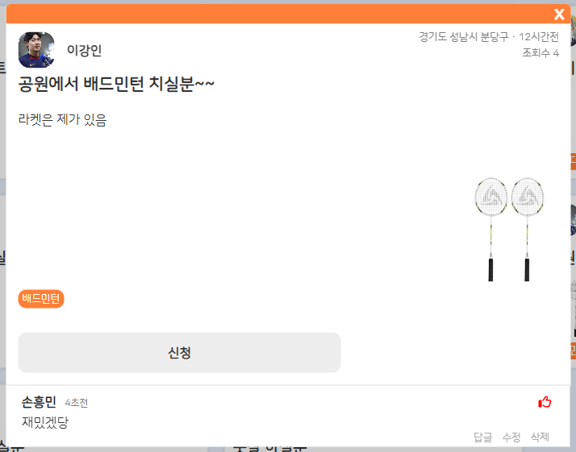

# 코끼리끼리


## 📝 프로젝트 개요

**코끼리끼리**는 사회성이 좋은 동물인 '코끼리'와 '끼리끼리 놀다'의 '끼리끼리'의 합성어로, 단순히 같이 취미생활을 즐기거나 놀 사람을 찾을 수 있는 매칭 플랫폼입니다. 기존의 매칭 플랫폼들이 특정 주제에 한정되거나 이성 만남 용도로만 사용되는 한계를 극복하고자 기획되었습니다.

## ✨ 주요 기능

- **회원 관리:**
  - 회원 가입 및 로그인 (프로필 이미지 등 다양한 정보 등록)
  - JWT 기반 사용자 인증 및 보안 세션 관리
  - 마이페이지에서 내 정보 보기/수정, 작성글/댓글 조회
  - 차단 기능을 통한 불필요한 사용자 상호작용 방지
- **매칭 시스템:**
  - 매칭글 작성을 통한 구인
  - 게시글을 보고 신청하는 방식의 매칭
  - 관심사, 지역 기반 필터링
  - 매칭 승낙 및 완료 프로세스
- **게시판 기능:**
  - 카드형 매칭글 게시판 (사진 첨부 가능)
  - 댓글/대댓글 시스템 및 좋아요 기능
  - 한줄평 형식의 후기 게시판
- **실시간 소통:**
  - 웹소켓 기반 실시간 채팅 (개인/그룹)
  - 실시간 알림 시스템 (매칭 신청, 승낙, 채팅 등)
  - 알림 클릭 시 해당 컨텐츠로 이동
- **사용자 상호작용:**
  - 프로필 카드 (앞면/뒷면 구조)
  - 사용자 간 좋아요 기능 (인기도 시스템)
  - 차단 기능으로 특정 사용자의 컨텐츠 필터링

## 🛠️ 기술 스택

| 구분             | 기술                                                                            |
| :--------------- | :------------------------------------------------------------------------------ |
| **언어**         | `Java`, `HTML/CSS`, `JavaScript`                                                |
| **백엔드**       | `Spring`, `Spring Boot`, `WebSocket`, `Stomp`, `Query DSL`, `Apache Tomcat 9.0` |
| **프론트엔드**   | `React`, `Redux`, `Bootstrap`                                                   |
| **데이터베이스** | `Oracle 11g`                                                                    |
| **개발 도구**    | `Visual Studio Code`, `IntelliJ`, `SQL Developer`, `Github`                     |

## 📐 아키텍처 및 주요 구현 내용

### 백엔드

- **RESTful API 설계:** 자원 중심의 일관된 API 엔드포인트 설계
- **Spring Security & JWT:**
  - JWT 토큰 기반의 Stateless 인증/인가 시스템 구현
  - 경로별 접근 권한 제어 (`WebSecurityConfig`)
  - 커스텀 필터(`JwtAuthenticationFilter`)를 통한 요청 헤더의 토큰 검증
  - 토큰 생성 및 유효성 검증 로직 (`TokenProvider`)
- **매칭 시스템:**
  - 매칭글 작성, 신청, 승낙, 완료의 일련의 프로세스 구현
  - 매칭 신청자 목록 관리 및 차단된 사용자 필터링
- **댓글 시스템:**
  - 대댓글 기능 구현 (자기 참조 구조)
  - 댓글 좋아요 기능 구현
- **실시간 알림 및 채팅:**
  - WebSocket과 STOMP를 활용한 실시간 통신
  - 채팅방 참여/퇴장 메시지 자동 생성
  - 그룹 채팅방 생성 및 관리
- **검색 및 필터링:**
  - Query DSL을 활용한 동적 쿼리 생성
  - 다중 조건 필터링 (관심사, 지역 등)
  - 차단된 사용자 컨텐츠 자동 필터링
- **파일 업로드:**
  - 매칭글 사진 첨부 기능 (최대 3개)
  - 프로필 이미지 업로드 및 관리

### 프론트엔드

- **상태 관리:** Redux를 활용한 전역 상태 관리 (사용자 정보, 채팅 등)
- **카드형 UI:** 매칭글 및 프로필을 카드 형태로 표시하여 직관적인 UX 제공
- **실시간 알림 UI:** 우측 하단 토스트 메시지로 실시간 알림 표시
- **무한 스크롤:** 게시글 더보기 버튼을 통한 추가 컨텐츠 로드

### 실시간 소통 시스템

- **WebSocket 연결 관리:**
  - 사용자별 웹소켓 연결 관리
  - 채팅방 및 알림에 대한 STOMP 구독 설정
- **채팅 메시지 처리:**
  - 메시지 전송, DB 저장, 알림 처리의 통합 로직
  - 차단된 사용자 메시지 필터링
- **알림 시스템:**
  - 매칭 신청/승낙, 좋아요, 댓글 등 다양한 알림 유형 지원
  - 알림 확인 상태 관리 및 중복 알림 방지

### 사용자 상호작용

- **프로필 카드:** 앞/뒷면 전환 가능한 카드 디자인으로 정보 표시
- **좋아요 시스템:** 사용자 간 좋아요 기능으로 인기도 측정
- **차단 기능:** 차단한 사용자의 컨텐츠(게시글, 댓글, 매칭신청, 채팅)를 모두 필터링

### Socket.IO: 실시간 양방향 통신 구현

## 🗃️ 데이터베이스 구조

주요 엔티티:

- User (사용자 정보)
- Post (매칭 게시글)
- Comments (댓글)
- MatchingUserInfo (매칭 정보)
- Place (장소)
- Category (카테고리)
- ChatRoom (채팅방)
- ChatMessage (채팅 메시지)
- UserLike (좋아요)
- BlockUsers (차단 목록)


## 📈 개발 과정 및 배운 점

### 개발 과정

- **DB 모델링 단계:** 매칭, 채팅, 사용자 관계 등 복잡한 데이터 구조를 체계적으로 설계
- **REST API 설계:** 프론트엔드와 백엔드 간 효율적인 통신을 위한 API 설계
- **웹소켓 구현:** 실시간 기능을 위한 WebSocket 및 STOMP 통합
- **UI/UX 디자인:** 사용자 중심의 직관적인 인터페이스 설계

### 주요 학습 내용

- **Spring Boot 기반 백엔드 개발:** RESTful API 설계 및 구현 경험
- **Query DSL을 활용한 동적 쿼리:** 복잡한 검색/필터링 기능 구현
- **WebSocket 및 STOMP:** 실시간 통신 시스템 설계 및 구현
- **React/Redux 상태 관리:** 복잡한 UI 상태를 효율적으로 관리하는 방법
- **DB 설계 및 최적화:** 관계형 데이터베이스 모델링 및 쿼리 최적화 경험

### 도전 과제 및 해결

- **실시간 채팅/알림 구현:** WebSocket과 STOMP를 활용하여 안정적인 실시간 통신 구현
- **복잡한 매칭 프로세스:** 상태 관리와 알림을 통합하여 매칭 워크플로우 완성
- **차단 기능의 전체 시스템 통합:** 모든 상호작용에서 차단된 사용자 필터링 로직 적용
- **동적 검색 및 필터링:** Query DSL을 활용하여 다양한 조건의 필터링 구현

## 🔍 프로젝트 스크린샷

### 메인페이지


### 게시글 상세보기



### 그룹 채팅방


### 프로필 카드 (앞면, 뒷면)


### 프로필 카드 (뒷면)


## 🔮 추가 개선 아이디어

- **게시글 첨부파일 기능 개선:** 하나씩 추가 가능한 파일 업로드 시스템 구현
- **마이페이지 내정보 수정 기능 안정화:** 사용자 정보 수정 프로세스 개선
- **차단한 유저 관련 알림 필터링:** 알림 시스템에 차단 로직 완전 통합
- **메인페이지 컨텐츠 강화:** 배너 등 추가 UI 요소 도입
- **전체적인 완성도 개선:** 코드 리팩토링 및 UI/UX 개선

## 💡 설치 및 실행 방법

### 요구사항

- JDK 11 이상
- Node.js 14 이상
- Oracle 11g
- Apache Tomcat 9.0

### 백엔드 설정

```bash
# 저장소 클론
git clone https://github.com/HHOWI/ClassQ_team4_backend.git
cd ClassQ_team4_backend

# application.properties 설정
# DB 연결 정보, 서버 포트 등 설정

# 빌드
./gradlew build

# 또는 IntelliJ IDEA를 통해 실행
```

### 프론트엔드 설정

```bash
# 저장소 클론
git clone https://github.com/HHOWI/ClassQ_team4_frontend.git
cd ClassQ_team4_frontend

# 의존성 설치
npm install

# 개발 서버 실행
npm start
```

## 📫 연락처

- **GitHub**: [https://github.com/HHOWI](https://github.com/HHOWI)
- **Backend Repository**: [https://github.com/HHOWI/ClassQ_team4_backend](https://github.com/HHOWI/ClassQ_team4_backend)
- **Frontend Repository**: [https://github.com/HHOWI/ClassQ_team4_frontend](https://github.com/HHOWI/ClassQ_team4_frontend)

## 🙏 감사의 말

이 프로젝트는 5명의 팀원이 함께 노력한 결과물입니다. 프로젝트 기간 동안 서로 협력하고 도움을 준 모든 팀원들에게 감사드립니다.
